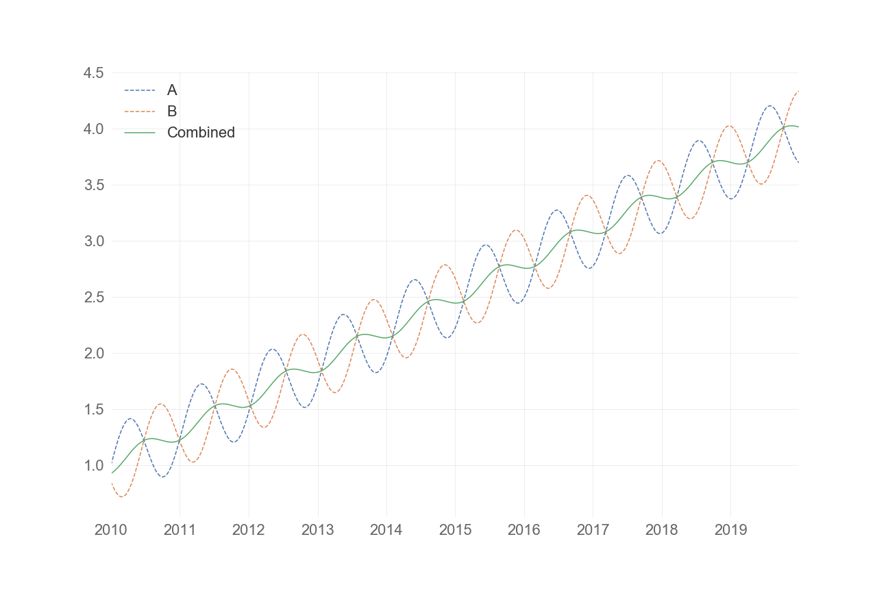
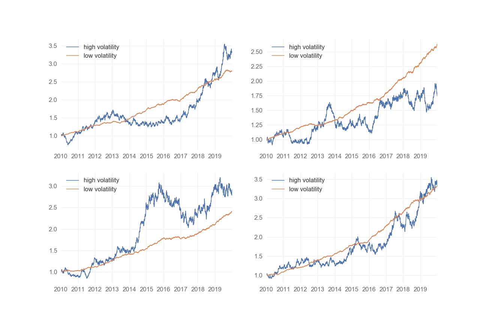
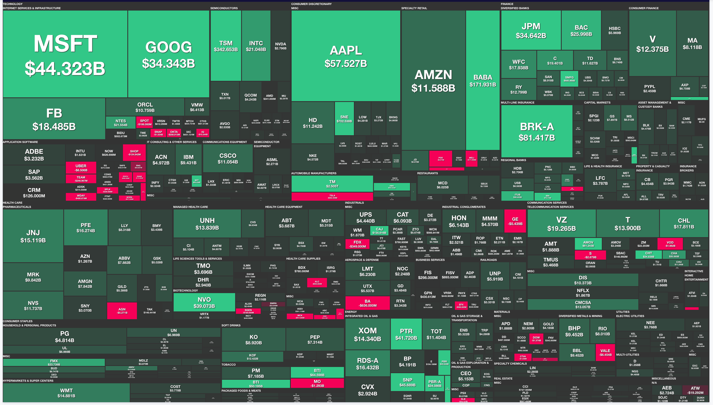
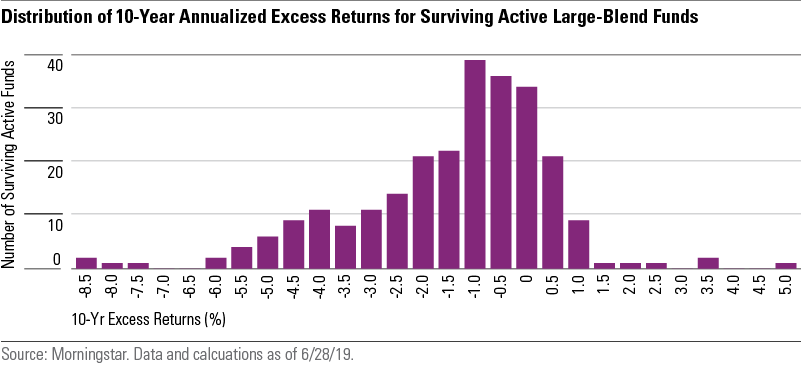
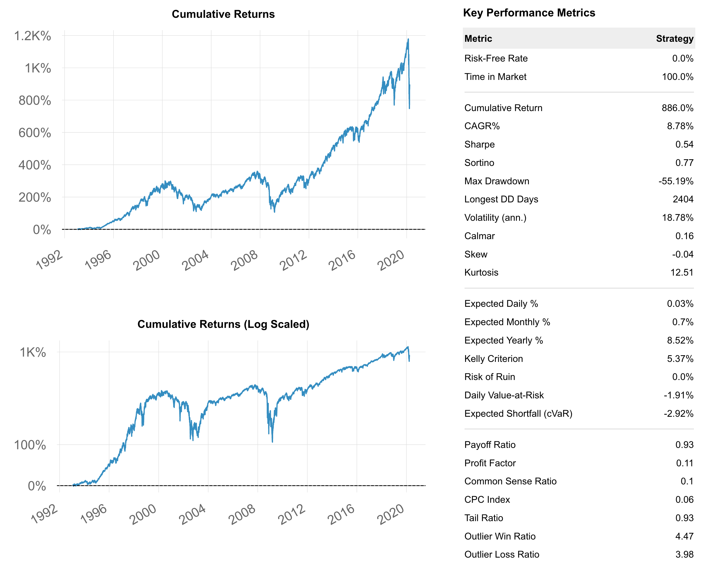
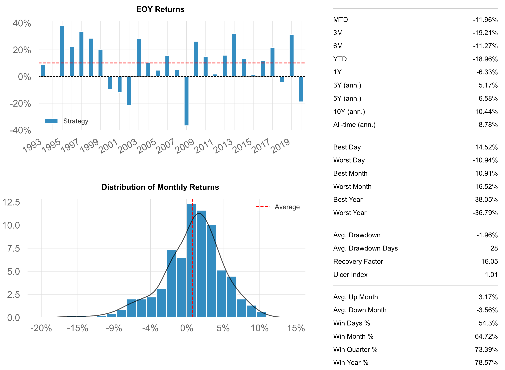
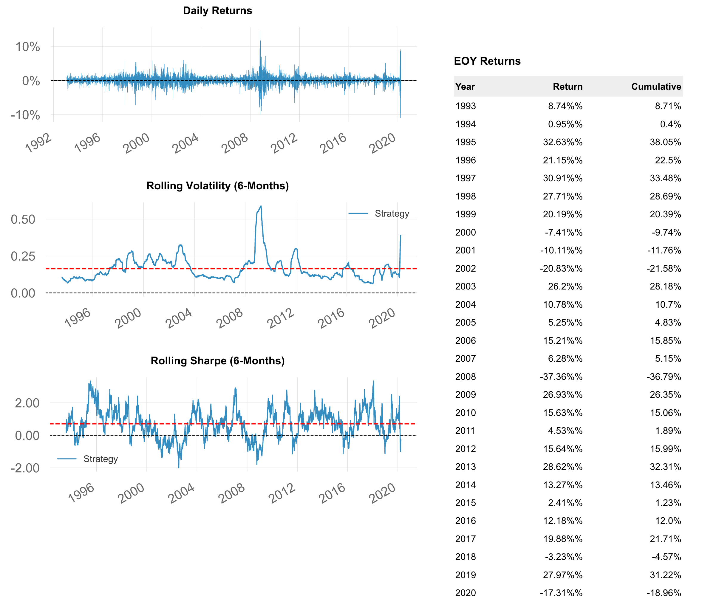

# HOW TO SPEAK GUAPANESE

## AKA LET-US GET THIS LETTUCE

## AKAKA the basics of financial assets and how to become an investor

### School of Continuing Buddies

# Goal
provide a baseline understanding of financial assets and investing so you can think about what to invest in, how to invest, and why you should (or should not) invest

all in 15 mins! sooo a lot of hand waving


## DISCLAIMER

## THIS IS NOT INVESTMENT ADVICE

## THE PERSON PRESENTING IS NOT QUALIFIED OR LICENSED TO LEGALLY GIVE INVESTMENT ADVICE, AND THE INFORMATION CONTAINED HERE SHOULD NOT BE CONSTRUED AS SUCH

## THIS INFORMATION IS STRICTLY FOR EDUCATIONALY PURPOSES ONLY

# Outline
1. Financial Assets
  * stocks
  * bonds
  * fundamental theorem of finance **<- some math**

2. Investing **<- some math**
  * constructing a portfolio
  * benefits of diversification
  * risk, return, and risk adjusted return

3. So What Should **You** do?
  * index funds. mutual funds
  * open an account and invest
  * key takeaways

4. Resources

# 1. Financial Assets

financial assets are things you own that entitle you to cash flow - just by owning them. 

they differ from other physical assets like a car or a home which are used to do things which may or may not ultiamtey bring in money.

if you want to make money from your car, you have to drive ppl around for uber!
if you want to make money at your job you have to work!
if you want to make money with a finnanical asset you have to sit on your A$$! **and** assume risk.

## Stocks
* represent piece of ownership of a company.
* why do you want ownership? Profits Of course!
* risky - if company makes no profits, you get no profits. If company goes bankrupt you're SOL.

## Bonds
* a tradable loan. principal, interest, maturity.
* less risky than stocks. Companies must pay interest on debt before they can take profits.
* if a compnay goes bankrupt, or defaults on a payment you have more rights to money from selling company assets than stock holders.


## Fundamental Theorem of Finance
* how much would you pay for 100 bones 1 year from now? how much if you had a 50\% chance of getting the 100 bones 1 year from now?
* A financial asset is worth all the **expected** future money it's supposed to pay you (discounted).
  * time value of money.
* for stocks this is (theoretically) all the future profits.
* for bonds this is all the future coupons (interest payments) and principal.


## The price of a financial asset represents the expectation of investors about money they will be payed

investors like guaranteed money. the riskier the company, the more the company has to pay investors to compensate them for the greater risk they're taking.
  * for equity investors (stock holders) this compensation is in the form of future profits.
  * for debt investors (bond holders) this compensation is in the form of interest.

the more uncertainy around how much money you're getting the more you need to guarantee investors to compensate them.

investors **don't like uncertainty**

## Case Study: Coronavirus

1. economy shuts down
2. demand goes down, business are making much less money, many making no money at all!
3. if no demand, what happens to profits? **DOWN**
4. according to the fundamental theorem of finance, price of a stock represents the future profits.
5. so what happens to stock prices? **DOWN**
6. so what happens to economy? **DOWN**


# 2. Investing

now that we know what stocks and bonds are how should we think about combining them into a portfolio?

## Constructing a Portfolio
if you have 50% of your'e money in apple and it goes up by 5% over the year, and 50% in Microsoft and it goes up by 10% then your'e total portfolio goes up by 7.5%: 

(50% X 5%) + (50% X 10%) = 7.5%

## Benefits of Diversification
Don't put all you're eggs in 1 basket!
If you invest in 2 stocks that are lowly correlated but go up overtime, then when one is down hopefully the other will be up! and vice-versa and your overal portfolio return will be smoothed out

## The Combined Portfolio Has Lower Volatility



## Risk, Return, Risk Adjsuted Return
Lots of ways to think about risk. One tangible way is by how much the asset bounces around on its way to its destination
  > measured statistically as the spread (standard deviation) of the price movements, also called **volatility**
  
  > the more volatile an asset is the greater probability that it could be low when you want to sell it. **BAD!**
  
risk adjusted return is the return / volatility. higher is better! it means the asset bounced around less on its way to its final destination.
  > **Benefits of Diversification Again** - by combining asssets with low correlation, smoothing the retuens means reducing the volatility -> increase risk adjusted returns. **GOOD**!

## Simulations of same returns but different volatilities



## Sharpe Ratio Revisited

Thing in in terms of statistics / information theory / human competency Sharpe Ratio 

### = (return / risk)

### = (signal / noise)
             
### = (skill / luck)

If you have 1 year history of returns and they're high (say 10%) but volatility is really high (say 80%) then from a statistical standpoint the price moved around sooo much it easily could have ended up at -10%.

> with a high volatility and short history, you can't disprove the assumption that the manager just got lucky!

or putting our statistician's hat on...

> with a high standard error (due to a high sample standard deviation and/or a small sample size) we can't disprove the null hypothesis that the mean of the distribution of returns is zero at a statistically significanat level.

# 3. So What Should **You** do?

how can you take advantage of all this information? 

invest in the market, via passive funds. eschew active funds.


## DISCLAIMER

## THIS IS NOT INVESTMENT ADVICE

## THE PERSON PRESENTING IS NOT QUALIFIED OR LICENSED TO LEGALLY GIVE INVESTMENT ADVICE, AND THE INFORMATION CONTAINED HERE SHOULD NOT BE CONSTRUED AS SUCH

## THIS INFORMATION IS STRICTLY FOR EDUCATIONALY PURPOSES ONLY

## Index Fund/ETF
they invest in the braod market.

they allocates money to assets according to big they are (how much of the market they take up)
> so for example a US Index fund would invest most in Microsoft since its the biggest, then the second most in Amazon since its the second biggest etc.

they have index funds for bonds too. but you should be invested mostly in stocks since their riskier, but historically generate higher returns

Index funds have better returns and better sharpe than actively managed funds (mutual funds and hedge funds)

## US Market + Income


## Active Funds Lose Money



## Actionable Steps
1. Go to your bank,ask to open up a brokerage account (how you buy and sell financial assets).
2. Or Open up an account with Charles Schwab, they're good and don't charge fees to trade
3. Ask Your broker, or submit the order through their website, to buy Fidelity US Index ETF
> symbol is **FZROX** and they charge you a ZERO PERCENT FEE for managing your money
> can also ask for **SPY** which was the very first ETF and started in 1993.
4. Invest a little bit every month
5. Sit back and relax and let the $ roll in

## DISCLAIMER

## THIS IS NOT INVESTMENT ADVICE

## THE PERSON PRESENTING IS NOT QUALIFIED OR LICENSED TO LEGALLY GIVE INVESTMENT ADVICE, AND THE INFORMATION CONTAINED HERE SHOULD NOT BE CONSTRUED AS SUCH

## THIS INFORMATION IS STRICTLY FOR EDUCATIONAL PURPOSES ONLY

## Key Takeaways

* return: **GOOD**
* volatility: **BAD**
* sharpe ratio = risk-adjuseted return: **(return / volatility) | higher is better**
* do: **open a brokerage account and put a little in every month**
* do: **invest in Index Funds/ETFS**
* do: **DIVERSIFY (Index Funds do this automatically)**
* do not: **invest in hedge funds or mutual funds**


# Resources

open a brokerage account: https://www.schwab.com/public/schwab/client_home


intro to investing: https://www.thebalance.com/investing-for-beginners-4074004


intro to investing: https://www.investopedia.com/articles/basics/11/3-s-simple-investing.asp


book on fundamental analysis:https://www.amazon.com/Intelligent-Investor-Definitive-Investing-Essentials/dp/0060555661


book on quant investing: https://www.amazon.com/Active-Equity-Management-Xinfeng-Zhou/dp/0692297774/ref=sr_1_1?dchild=1&keywords=active+equity+management&qid=1586067607&s=books&sr=1-1


## US Market Performace Since 1993






## DISCLAIMER

## THIS IS NOT INVESTMENT ADVICE

## THE PERSON PRESENTING IS NOT QUALIFIED OR LICENSED TO LEGALLY GIVE INVESTMENT ADVICE, AND THE INFORMATION CONTAINED HERE SHOULD NOT BE CONSTRUED AS SUCH

## THIS INFORMATION IS STRICTLY FOR EDUCATIONALY PURPOSES ONLY


```python

```
